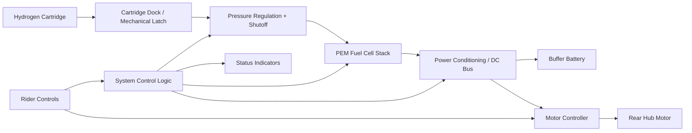

# Project Tidus

## System Block Diagram and Interface Map

## 1. Purpose

This document translates the locked Phase 1 architecture into a subsystem map that can support build planning, integration sequencing, and safety review.

It is not a detailed electrical schematic or manufacturing drawing. It is a system-level integration document that defines what the major blocks are and how they are expected to interact.

## 2. System Boundary

The prototype system includes:

- User-swappable hydrogen cartridge
- Hydrogen regulation and delivery path
- PEM fuel cell subsystem
- Shared DC power bus
- Buffer battery subsystem
- Motor controller and rear hub motor
- Rider controls and basic system status feedback
- Mounting, enclosure, and service-access structure required to package the above on a bicycle

The prototype system does not include:

- Offboard hydrogen production
- Cartridge filling infrastructure
- Production industrial design
- Advanced telematics or cloud features

## 3. High-Level Block Diagram

## 4. Functional Blocks

### 4.1 Hydrogen Cartridge

Role:

- Stores onboard hydrogen
- Provides the core refueling interaction through removal and replacement

Primary requirements:

- Commercially rated pressure vessel
- Repeatable insertion and removal
- Geometry suitable for bicycle-integrated mounting

Primary interfaces:

- Mechanical interface to cartridge dock
- Gas interface to regulated hydrogen path
- User interface for swap handling

### 4.2 Cartridge Dock and Mechanical Latch

Role:

- Locates, secures, and aligns the cartridge
- Provides the controlled interface between user action and the hydrogen subsystem

Primary requirements:

- Tool-less user action
- Positive retention during riding
- Guided insertion with low risk of incorrect seating

Primary interfaces:

- Mechanical lock/unlock path
- Gas path handoff to regulation stage
- Optional sensor or switch for cartridge presence detection

### 4.3 Pressure Regulation and Shutoff

Role:

- Reduces stored hydrogen pressure to the operating range required by the fuel cell
- Provides the first controlled safety boundary after the cartridge

Primary requirements:

- Pressure regulation compatible with the chosen cartridge and fuel cell
- Manual or system-controlled shutoff access
- Compact routing and ventilation-aware placement

Primary interfaces:

- Upstream cartridge gas input
- Downstream regulated fuel-cell supply
- Safety and service access

### 4.4 PEM Fuel Cell Subsystem

Role:

- Converts hydrogen into electrical power for the vehicle

Primary requirements:

- Support roughly 400W-class continuous output
- Stable operation in bicycle packaging constraints
- Integration with air flow, water management, and electrical output conditioning

Primary interfaces:

- Regulated hydrogen input
- Air intake and exhaust path
- Electrical output to DC bus or conditioning electronics
- Status and fault interface to system control logic

### 4.5 Power Conditioning and DC Bus

Role:

- Serves as the electrical handoff point between the fuel cell, battery, and traction system
- Maintains a stable shared electrical architecture

Primary requirements:

- Match the 48V nominal system target
- Support current flow to both battery and motor controller paths
- Provide basic protection and isolation behavior

Primary interfaces:

- Fuel cell electrical input
- Battery charge and discharge path
- Controller supply path
- Protection and disconnect elements

### 4.6 Buffer Battery Subsystem

Role:

- Absorbs load transients
- Supports startup and peak demand
- Provides short-duration fallback power

Primary requirements:

- 48V nominal e-bike battery class
- Electrically compatible with the shared bus architecture
- Mounting position consistent with bicycle mass centralization

Primary interfaces:

- Charge and discharge connection to DC bus
- Battery management and protection
- Service disconnect access

### 4.7 Motor Controller

Role:

- Converts bus power into controlled motor drive behavior
- Executes rider input commands using standard e-bike control behavior

Primary requirements:

- Compatible with a 48V rear hub motor
- Supports pedal-assist and throttle behavior if used
- Handles peak motor demand through the battery-assisted hybrid system

Primary interfaces:

- Electrical power from DC bus
- Control input from rider controls
- Motor phase and sensor connections

### 4.8 Rear Hub Motor

Role:

- Produces wheel torque and propulsion

Primary requirements:

- Standard off-the-shelf e-bike class component
- Approximately 500W nominal, 750W peak class target
- Rear wheel integration for prototype simplicity

Primary interfaces:

- Electrical connection to motor controller
- Mechanical integration with rear wheel and frame dropout

### 4.9 Rider Controls and Status Feedback

Role:

- Gives the rider a familiar e-bike interaction model
- Provides minimum viable system awareness

Primary requirements:

- Conventional rider input layout
- Clear indication of startup, ready, fault, and low-energy states
- No requirement for the rider to understand hydrogen subsystem complexity during normal use

Primary interfaces:

- Input to motor controller and system logic
- Output from status indicators or simple display elements

### 4.10 System Control Logic

Role:

- Coordinates startup state, shutdown state, and fault handling across subsystems

Primary requirements:

- Minimal but deliberate state management
- Prevent unsafe or confusing startup behavior
- Support safe isolation in abnormal conditions

Primary interfaces:

- Cartridge presence or latch state, if sensed
- Fuel cell status and fault signals
- DC bus or battery status signals
- User-facing ready and fault indication outputs

## 5. Interface Map

### 5.1 Mechanical Interfaces

| Interface | From | To | Function |
| --- | --- | --- | --- |
| M1 | Cartridge | Cartridge dock | Locate and retain cartridge |
| M2 | Cartridge dock | Frame structure | Mount swap mechanism into bike |
| M3 | Fuel cell assembly | Central frame enclosure | Support stack and cooling path |
| M4 | Battery pack | Frame enclosure | Secure buffer battery in central mass area |
| M5 | Rear hub motor | Rear frame dropout / wheel | Deliver propulsion torque |

### 5.2 Hydrogen Interfaces

| Interface | From | To | Function |
| --- | --- | --- | --- |
| H1 | Cartridge | Dock connection | Transfer hydrogen from removable cartridge |
| H2 | Dock connection | Pressure regulation stage | Move stored hydrogen into controlled path |
| H3 | Regulation stage | Fuel cell | Deliver hydrogen at usable operating conditions |

### 5.3 Electrical Power Interfaces

| Interface | From | To | Function |
| --- | --- | --- | --- |
| E1 | Fuel cell | DC bus / conditioning | Supply continuous electrical power |
| E2 | Battery | DC bus | Supply and absorb transient power |
| E3 | DC bus | Motor controller | Feed traction power electronics |
| E4 | Motor controller | Rear hub motor | Deliver controlled motor drive power |

### 5.4 Control and Signal Interfaces

| Interface | From | To | Function |
| --- | --- | --- | --- |
| C1 | Rider controls | Motor controller | Command assist behavior |
| C2 | Rider controls | System logic | Request startup or operating state |
| C3 | Fuel cell | System logic | Report ready, fault, or operating state |
| C4 | Battery / bus monitoring | System logic | Report electrical status |
| C5 | System logic | Status indicators | Communicate ready and fault states |
| C6 | Cartridge dock sensor, if used | System logic | Confirm installed cartridge state |

## 6. User-Facing vs Service-Facing Interfaces

### User-Facing Interfaces

- Cartridge insertion and removal
- Power-on or ride-enable control
- Standard e-bike rider controls
- Ready, warning, and fault indication

These must feel simple and repeatable.

### Service-Facing Interfaces

- Shutoff and isolation access
- Electrical disconnect points
- Diagnostic access to fuel cell and battery systems
- Mechanical removal paths for cartridge dock, fuel cell, and battery modules

These must remain accessible without turning the bike into an exposed test stand.

## 7. Integration Priorities

The most critical subsystem couplings are:

1. Cartridge dock to pressure regulation
2. Regulation stage to fuel cell
3. Fuel cell output to shared DC bus
4. DC bus to battery and motor controller
5. Rider controls and system logic to startup and fault behavior

These interfaces should drive the first build plan because failures here will break the overall system concept, not just polish.

## 8. Failure-Sensitive Boundaries

The following boundaries deserve special attention in later safety and test documentation:

- Cartridge seating and lock confirmation
- High-pressure to regulated-pressure transition
- Fuel cell startup and shutdown behavior
- DC bus stability under changing load
- Battery support during acceleration and other peak demand events
- Fault signaling that tells the rider when the system is not safe or not ready

## 9. Open Items Held for Later Documents

This document does not yet lock:

- Exact connector part numbers
- Exact regulator specifications
- Exact battery capacity
- Detailed wiring harness design
- Cooling path geometry
- Enclosure materials and fabrication method

Those belong in the prototype build plan and safety/test checklist, after the system boundaries are accepted.

## 10. Document Outcome

This document defines the major system blocks and the interfaces between them for the Tidus prototype.

The build-sequencing follow-on is documented in `docs/prototype-build-plan.md`.

The next useful artifacts after this are the procurement sheet, phase-by-phase build checklist, and safety/test checklist.
